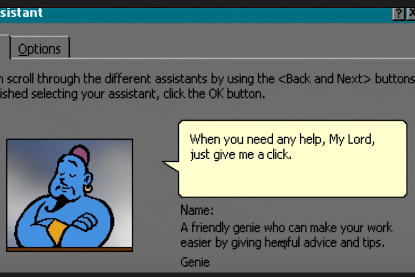

_These are my thoughts on working with AI as a coding partner, and how it’s quietly changing the way we build software._

I've been coding for over a decade and have never seen anything like what's happening right now. The developer landscape isn't just getting new tools — it's undergoing a fundamental shift in how we think, collaborate, and solve problems.

This connects with a [thoughtful reflection](https://temochka.com/blog/posts/2025/08/03/elephant-in-the-room.html) I recently read about. The author captures a fascinating contradiction: AI has "sucked all the air out of the room" in tech discussions, yet it's also unlocked programming experiences that feel magical.

## The rise of vibe-coding

To me, "vibe-coding" is the weird, intuitive flow between what I'm thinking and what AI suggests. It's not just faster coding; it's like having a smart rubber duck that talks back and sometimes has better ideas than I do.

Last week, I found myself explaining a complex algorithm to Claude before I'd even fully understood it myself. AI helped me think through the problem while simultaneously generating code. It felt like pair programming with myself, but smarter.

This isn't just my experience. Recent [analysis of AI tool usage at tech companies](https://newsletter.pragmaticengineer.com/p/software-engineering-with-llms-in-2025) shows developers are finding complex ways to integrate these tools into their workflows, but it's not the straightforward productivity boost many expected.

Here's what's interesting: AI handles repetitive coding tasks brilliantly, pushing me to sharpen high-level thinking and architectural judgment. I need to get better at breaking down problems, making deliberate design choices, and learning when to trust or verify AI suggestions.

## When AI starts making executive decisions

Agentic coding systems don't just complete my thoughts — they make decisions I didn't even know were needed. I watched one debug a memory leak last month by refactoring a bunch of different modules and updating the test suite. Fascinating but weird.

This challenge led me toward spec-driven development. Rather than letting agents dive straight into code, I now have them outline solutions first — design the feature, explain how to build it, and then I review and guide the approach before any code is written. This small adjustment makes spotting problems in a written plan far easier than in code.

<blockquote class="admonition tip">

Tip

I've been experimenting with <a href="https://github.com/nicksp/ai-coding-worflow">a simplified two-step workflow</a> inspired by <a href="https://kiro.dev/docs/specs/concepts/">Kiro</a>. The first mode focuses purely on design and architectural thinking, the second handles implementation. This separation creates natural checkpoints where human judgment stays central.

</blockquote>

It's not about holding back AI — it's about guiding it thoughtfully.

## The skill paradox nobody talks about

Here's the kicker: more automation doesn't reduce the need for expertise. It's the opposite. We now need to be good at context engineering, result evaluation, and what I call "AI whispering" — knowing how to collaborate with these systems without losing our minds or lowering code quality standards.

This paradox is playing out across the industry. A [study from July 2025](https://metr.org/blog/2025-07-10-early-2025-ai-experienced-os-dev-study/) found that experienced open-source developers actually took 19% longer to complete tasks when using AI tools. They got slower, not faster. Meanwhile, GitHub research emphasizes [that knowing why the code works](https://github.blog/developer-skills/career-growth/why-developer-expertise-matters-more-than-ever-in-the-age-of-ai/) is what separates good developers from great ones in the AI age.

Junior developers are now shipping complex solutions that would've taken them weeks to learn the hard way. But when something breaks — and it usually does — they don't have the foundational understanding to fix it. I've seen this happen multiple times in my own experience.

This shows we're witnessing a new kind of developer, with a relationship to code and problem-solving unlike anything we've seen before. Recent observations about this generational shift acknowledge that ["vibe coders and self-taught ChatGPT users are programmers too"](https://lucumr.pocoo.org/2025/7/20/the-next-generation/). It's a fundamentally different approach to the craft.

## Code quality in the age of AI

Traditional code quality metrics don't quite fit anymore. AI can generate clean, well-documented code in seconds, but it misses the bigger picture — the _why_ behind the code.

I've always cared about architectural coherence in code reviews, but AI-generated code has made it the primary focus. Now, the key question isn't whether code runs but whether I can maintain, debug, and extend it when things inevitably go wrong.

It's both challenging and liberating, forcing attention on what truly matters. I can already see how it creates new forms of technical debt we'll be dealing with: perfectly working code that's hard to read, architectures built without deliberate design, and dependencies on AI systems no one fully understands.

This shift reflects broader industry concerns about AI's impact on code quality. Recent research suggests that while AI accelerates development, it may be "at the expense of maintainable, quality code." [New thinking on developer productivity metrics](https://medium.com/@adnanmasood/rethinking-developer-productivity-in-the-age-of-ai-metrics-that-actually-matter-61834691c76e) emphasizes moving beyond traditional measurements to frameworks that capture the complex reality of AI-assisted development.

## Finding the right workflow

After months of experimentation, I've settled into a workflow that feels sustainable. I mostly use LLMs for planning and brainstorming ideas — that high-level thinking where having a conversational partner helps me work through possibilities I hadn't considered. When I hit weird errors or get stuck on implementation, AI gives me that initial kick to move forward without diving into Stack Overflow rabbit holes for hours.

I've also started using AI to review my work before publishing. It catches obvious issues without bothering colleagues with preliminary feedback. But I don't trust AI with critical business logic or performance-sensitive code — I'm always supervising closely when the stakes are high. The tools keep evolving, and I'm constantly experimenting, but that [two-step methodology](https://github.com/nicksp/ai-coding-worflow) I described earlier remains the crucial foundation in my work.

<blockquote class="admonition note">

Personal note

I've found that my relationship with these tools mirrors how I work best in general. I need to understand the "why" before diving into the "how," and AI works brilliantly as a thinking partner for that first part while staying useful but supervised for the execution.

</blockquote>

## The hidden cost of speed

AI-accelerated development comes with a hidden cost: errors propagate just as fast as features. Studies back this up — Microsoft [found a 26% productivity increase with Copilot](https://www.infoq.com/news/2024/09/copilot-developer-productivity/), and Google [observed 21% faster task completion](https://addyo.substack.com/p/the-reality-of-ai-assisted-software). But these metrics capture speed, not long-term maintainability or debugging challenges.

Rapid AI prototyping is like driving a sports car: powerful, but mistakes happen faster and hit harder.

## The real revolution

Looking back, the most profound change isn't in productivity — it's in how I approach coding. I'm learning to balance writing and thinking about code myself with orchestrating AI assistance.

The developers thriving in this new world aren't necessarily the ones using AI the most; they're the ones with good instincts for collaborating with these systems while keeping deep technical judgment. It's like learning to dance with a partner who's incredibly skilled but occasionally tries to lead you off a cliff.

This shift is transforming everything: team dynamics, organizational structures, and even the economics of building software. Adopting AI tools is easy. The real challenge is integrating them thoughtfully by preserving creativity, maintaining code quality, and avoiding the trap of automating ourselves into incompetence.

The transformation I mentioned at the start isn't just about new capabilities — it's about fundamentally changing our relationship with the craft of programming. We're not just changing how we code — we're redefining what it means to be a developer in the age of AI.

And honestly? Even with all the challenges, I've never been more excited to build software. I'm still writing code, debugging, and thinking hard. Working alongside a partner that challenges me at every step reminds me that the craft of coding and designing applications thoughtfully still matters in the age of AI.

_Thanks to [Artem Sapegin](https://sapegin.me/) for the countless conversations that helped shape these ideas._
